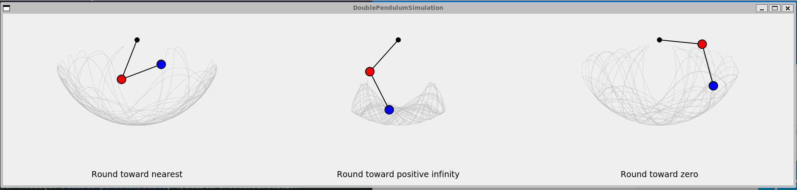

# double-pendulum-float-error

このリポジトリは、Qtを使用して実装された二重振り子シミュレーションのプロジェクトです。浮動小数点の丸め誤差がどのように二重振り子の動作に影響するかを視覚化します。



## ビルド手順

このプロジェクトをビルドするには、以下の手順に従ってください。

1. リポジトリをクローンします。

    ```sh
    git clone <リポジトリのURL>
    cd double-pendulum
    ```

2. ビルドディレクトリを作成し、CMakeを実行します。

    ```sh
    mkdir build
    cd build
    cmake ..
    ```

3. Makeを使用してプロジェクトをビルドします。

    ```sh
    make
    ```

## 実行方法

ビルドが成功したら、以下のコマンドでシミュレーションを実行できます。

```sh
./build/DoublePendulumSimulation
```
